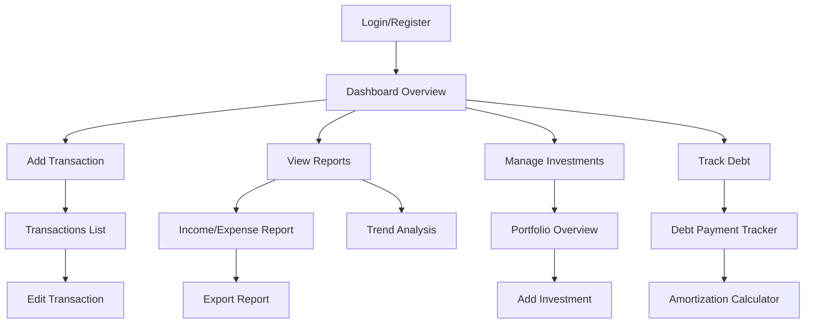

# Finance Dashboard Management System - Product Requirements Document

## 1. Product Overview

The Finance Dashboard Management System is a comprehensive financial tracking and visualization platform designed to help users manage their personal finances effectively. The system provides real-time insights into financial health through interactive charts, detailed transaction management, and comprehensive reporting capabilities.

The platform solves the problem of financial disorganization by providing users with intuitive tools to track income, expenses, investments, debts, and assets in one centralized location. It helps users make informed financial decisions through data visualization and automated insights.

Target users include individuals seeking to improve their financial literacy, small business owners managing company finances, and anyone looking to gain better control over their financial situation.

## 2. Core Features

### 2.1 User Roles

| Role          | Registration Method                   | Core Permissions                                                                |
| ------------- | ------------------------------------- | ------------------------------------------------------------------------------- |
| Standard User | Email registration with Supabase auth | View and manage own financial data, create transactions, generate reports       |
| Premium User  | Subscription upgrade                  | Advanced analytics, unlimited transactions, priority support, custom categories |
| Admin         | System administrator                  | Manage users, system settings, view analytics                                   |

### 2.2 Feature Module

The finance dashboard consists of the following main pages:

1. **Dashboard Overview**: Financial summary cards, cash flow chart, recent transactions, quick actions
2. **Transactions Management**: Transaction list, add/edit forms, bulk operations, import/export
3. **Investment Portfolio**: Portfolio overview, asset allocation, performance tracking, investment transactions
4. **Debt Management**: Debt overview, payment tracking, amortization schedules, payoff strategies
5. **Reports & Analytics**: Income/expense reports, trend analysis, category breakdowns, custom reports
6. **Settings**: User profile, categories management, notification preferences, data export

### 2.3 Page Details

| Page Name          | Module Name             | Feature description                                                                           |
| ------------------ | ----------------------- | --------------------------------------------------------------------------------------------- |
| Dashboard Overview | Summary Cards           | Display total balance, monthly income/expenses, savings rate, net worth with trend indicators |
| Dashboard Overview | Cash Flow Chart         | Interactive line chart showing income vs expenses over time with filtering options            |
| Dashboard Overview | Recent Transactions     | List of latest 10 transactions with quick actions for editing/deleting                        |
| Dashboard Overview | Quick Actions           | Buttons for adding income, expense, transfer, investment, or debt payment                     |
| Transactions       | Transaction List        | Sortable, filterable data table with pagination and bulk operations                           |
| Transactions       | Add Transaction         | Form with fields for amount, category, date, description, tags, attachments                   |
| Transactions       | Edit Transaction        | Pre-populated form with same fields as add, plus delete functionality                         |
| Transactions       | Import/Export           | CSV import wizard, Excel/PDF export with custom date ranges                                   |
| Investments        | Portfolio Overview      | Current portfolio value, total gains/losses, asset allocation pie chart                       |
| Investments        | Asset List              | Table showing individual investments with current value, cost basis, gains                    |
| Investments        | Add Investment          | Form for recording stock purchases, mutual funds, crypto, real estate                         |
| Investments        | Performance Chart       | Line chart showing portfolio value over time with benchmark comparison                        |
| Debt Management    | Debt Overview           | Total debt, monthly payments, interest rates, payoff progress bars                            |
| Debt Management    | Debt List               | Table of all debts with balance, payment schedule, interest rate                              |
| Debt Management    | Payment Tracker         | Form for recording debt payments with principal/interest breakdown                            |
| Debt Management    | Amortization Calculator | Interactive calculator showing payoff schedules and interest savings                          |
| Reports            | Income/Expense Report   | Monthly breakdown with category comparison and variance analysis                              |
| Reports            | Trend Analysis          | Multi-year comparison charts for income, expenses, and savings                                |
| Reports            | Category Breakdown      | Pie charts showing spending distribution across categories                                    |
| Reports            | Custom Reports          | User-defined reports with custom date ranges and metrics                                      |
| Settings           | User Profile            | Name, email, currency preferences, timezone settings                                          |
| Settings           | Categories              | Create, edit, delete custom income and expense categories                                     |
| Settings           | Notifications           | Email alerts for budget limits, bill reminders, goal milestones                               |
| Settings           | Data Export             | Full data backup in multiple formats, scheduled exports                                       |

## 3. Core Process

### Standard User Flow:

1. User registers via email and completes profile setup
2. User adds initial financial accounts and categories
3. User begins recording transactions manually or via import
4. System automatically generates dashboard visualizations
5. User monitors financial health through charts and reports
6. User sets up notifications and goals for financial tracking

### Premium User Flow:

1. Standard user flow plus subscription upgrade
2. Access to advanced analytics and unlimited transactions
3. Custom categories and enhanced reporting features
4. Priority customer support and data insights

## 4. User Interface Design

### 4.1 Design Style

* **Primary Colors**: Deep blue (#1e40af) for primary actions, emerald (#059669) for positive values, rose (#e11d48) for negative values

* **Secondary Colors**: Gray scale for neutral elements, amber for warnings

* **Button Style**: Rounded corners with subtle shadows, primary buttons filled, secondary outlined

* **Typography**: Inter font family, 14px base size, clear hierarchy with font weights

* **Layout**: Card-based design with consistent spacing, responsive grid system

* **Icons**: Heroicons for consistency, color-coded by category type

* **Charts**: ApexCharts with custom color schemes matching brand colors

### 4.2 Page Design Overview

| Page Name    | Module Name         | UI Elements                                                                        |
| ------------ | ------------------- | ---------------------------------------------------------------------------------- |
| Dashboard    | Summary Cards       | Gradient backgrounds, large numeric displays, trend arrows with percentage changes |
| Dashboard    | Cash Flow Chart     | ApexCharts line chart with dual y-axis, interactive legend, date range selector    |
| Dashboard    | Recent Transactions | Clean table with alternating row colors, action buttons on hover                   |
| Transactions | Data Table          | TanStack Table with sorting icons, filter badges, pagination controls              |
| Transactions | Forms               | Two-column layout on desktop, single column mobile, floating labels                |
| Investments  | Portfolio Chart     | Donut chart with legend, percentage labels, interactive segments                   |
| Reports      | Report Cards        | White cards with subtle borders, export buttons top-right                          |
| Settings     | Form Sections       | Grouped settings with dividers, toggle switches for preferences                    |

### 4.3 Responsiveness

* **Desktop-First**: Optimized for 1920x1080 and 1366x768 resolutions

* **Mobile Adaptive**: Breakpoints at 768px and 480px

* **Touch Optimization**: Larger tap targets on mobile, swipe gestures for navigation

* **Tablet Support**: Enhanced sidebar navigation, optimized chart rendering

* **Print Support**: Clean print styles for reports and statements

