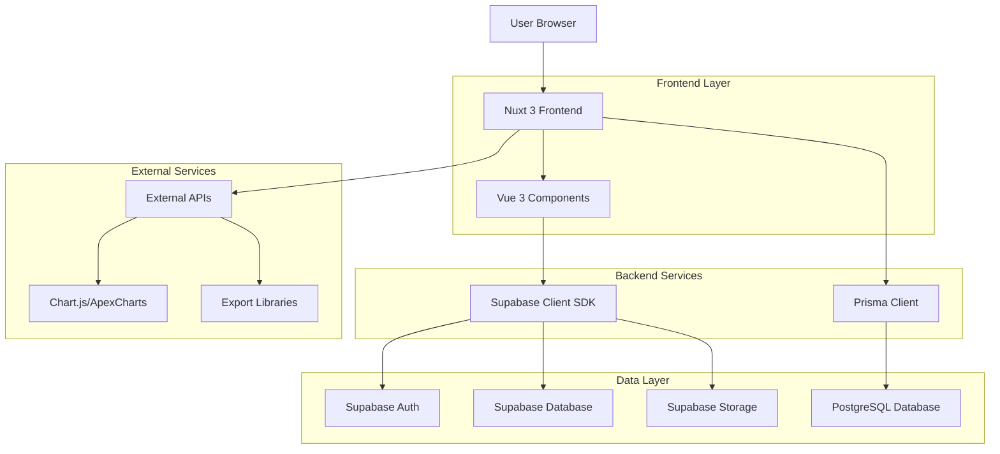
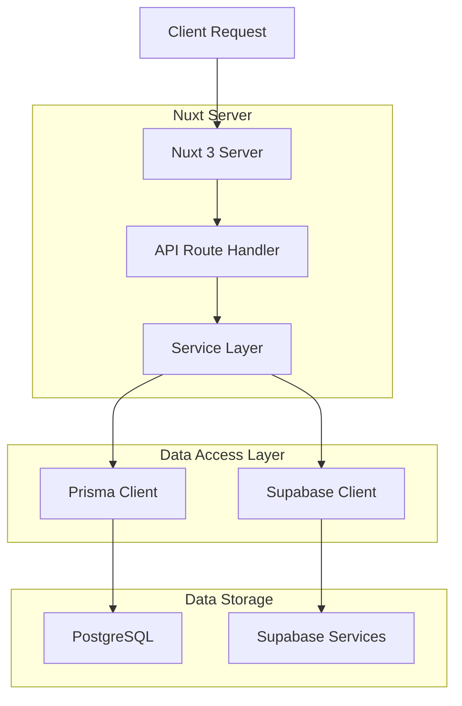
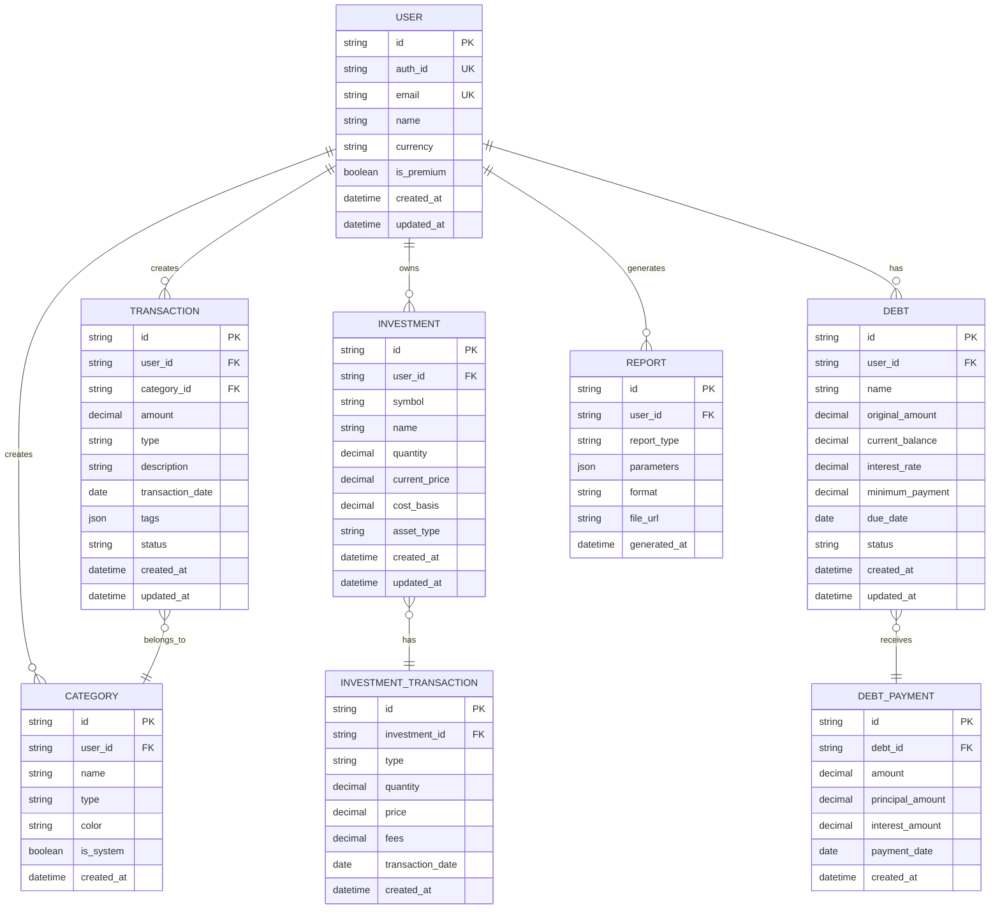

# Finance Dashboard Management System - Technical Architecture Document

## 1. Architecture Design



## 2. Technology Description

- **Frontend**: Nuxt 3 + Vue 3 + TypeScript + Tailwind CSS
- **Database**: PostgreSQL with Prisma ORM
- **Authentication**: Supabase Auth with JWT tokens
- **Real-time**: Supabase Real-time subscriptions
- **Charts**: ApexCharts.js with vue3-apexcharts wrapper
- **Tables**: TanStack Table with @tanstack/vue-table
- **Export**: SheetJS for Excel, pdfmake for PDF generation
- **Validation**: Zod schemas with VeeValidate
- **State Management**: Pinia with VueUse composables

## 3. Route Definitions

| Route | Purpose | Authentication |
|-------|---------|----------------|
| `/` | Landing page with login/signup | Public |
| `/dashboard` | Main dashboard overview | Protected |
| `/dashboard/transactions` | Transaction management | Protected |
| `/dashboard/investments` | Investment portfolio | Protected |
| `/dashboard/debt` | Debt management | Protected |
| `/dashboard/reports` | Financial reports | Protected |
| `/dashboard/settings` | User settings | Protected |
| `/dashboard/categories` | Category management | Protected |
| `/api/transactions` | Transaction CRUD API | Protected |
| `/api/investments` | Investment CRUD API | Protected |
| `/api/reports/export` | Export functionality | Protected |

## 4. API Definitions

### 4.1 Authentication API

**POST /api/auth/login**

Request:
```json
{
  "email": "user@example.com",
  "password": "securePassword123"
}
```

Response:
```json
{
  "user": {
    "id": "uuid",
    "email": "user@example.com",
    "name": "John Doe"
  },
  "session": {
    "access_token": "jwt_token",
    "refresh_token": "refresh_token",
    "expires_in": 3600
  }
}
```

### 4.2 Transaction API

**GET /api/transactions**

Query Parameters:
| Param | Type | Required | Description |
|-------|------|----------|-------------|
| page | number | false | Page number for pagination |
| limit | number | false | Items per page (default: 20) |
| category | string | false | Filter by category |
| type | string | false | Filter by type (income/expense) |
| startDate | string | false | Filter by start date |
| endDate | string | false | Filter by end date |

Response:
```json
{
  "data": [
    {
      "id": "uuid",
      "amount": 1250.00,
      "category": "Salary",
      "type": "income",
      "description": "Monthly salary",
      "date": "2024-01-15",
      "tags": ["monthly", "primary-income"]
    }
  ],
  "pagination": {
    "total": 150,
    "page": 1,
    "limit": 20,
    "totalPages": 8
  }
}
```

**POST /api/transactions**

Request:
```json
{
  "amount": 45.99,
  "category": "Groceries",
  "type": "expense",
  "description": "Weekly grocery shopping",
  "date": "2024-01-20",
  "tags": ["food", "weekly"]
}
```

### 4.3 Investment API

**GET /api/investments/portfolio**

Response:
```json
{
  "totalValue": 25000.00,
  "totalCostBasis": 22000.00,
  "totalGainLoss": 3000.00,
  "percentageGain": 13.64,
  "holdings": [
    {
      "id": "uuid",
      "symbol": "AAPL",
      "name": "Apple Inc.",
      "quantity": 10,
      "currentPrice": 150.00,
      "currentValue": 1500.00,
      "costBasis": 1400.00,
      "gainLoss": 100.00,
      "percentageGain": 7.14
    }
  ]
}
```

### 4.4 Reports API

**GET /api/reports/cash-flow**

Query Parameters:
| Param | Type | Required | Description |
|-------|------|----------|-------------|
| period | string | true | Period type (monthly/yearly) |
| year | number | true | Year for the report |

Response:
```json
{
  "period": "monthly",
  "year": 2024,
  "data": [
    {
      "month": "January",
      "income": 5000.00,
      "expenses": 3500.00,
      "netCashFlow": 1500.00
    }
  ]
}
```

**POST /api/reports/export**

Request:
```json
{
  "type": "excel",
  "reportType": "transactions",
  "dateRange": {
    "start": "2024-01-01",
    "end": "2024-12-31"
  },
  "format": "xlsx"
}
```

## 5. Server Architecture Diagram



## 6. Data Model

### 6.1 Database Schema



### 6.2 Data Definition Language

**Users Table**
```sql
CREATE TABLE users (
    id UUID PRIMARY KEY DEFAULT gen_random_uuid(),
    auth_id TEXT UNIQUE,
    email TEXT UNIQUE NOT NULL,
    name TEXT,
    currency VARCHAR(3) DEFAULT 'USD',
    is_premium BOOLEAN DEFAULT FALSE,
    created_at TIMESTAMP WITH TIME ZONE DEFAULT NOW(),
    updated_at TIMESTAMP WITH TIME ZONE DEFAULT NOW()
);

CREATE INDEX idx_users_auth_id ON users(auth_id);
CREATE INDEX idx_users_email ON users(email);
```

**Transactions Table**
```sql
CREATE TABLE transactions (
    id UUID PRIMARY KEY DEFAULT gen_random_uuid(),
    user_id UUID NOT NULL REFERENCES users(id) ON DELETE CASCADE,
    category_id UUID REFERENCES categories(id) ON DELETE SET NULL,
    amount DECIMAL(12,2) NOT NULL CHECK (amount > 0),
    type VARCHAR(20) NOT NULL CHECK (type IN ('income', 'expense', 'transfer')),
    description TEXT,
    transaction_date DATE NOT NULL,
    tags JSONB DEFAULT '[]',
    status VARCHAR(20) DEFAULT 'completed' CHECK (status IN ('pending', 'completed', 'cancelled')),
    created_at TIMESTAMP WITH TIME ZONE DEFAULT NOW(),
    updated_at TIMESTAMP WITH TIME ZONE DEFAULT NOW()
);

CREATE INDEX idx_transactions_user_id ON transactions(user_id);
CREATE INDEX idx_transactions_date ON transactions(transaction_date);
CREATE INDEX idx_transactions_type ON transactions(type);
CREATE INDEX idx_transactions_category ON transactions(category_id);
```

**Investments Table**
```sql
CREATE TABLE investments (
    id UUID PRIMARY KEY DEFAULT gen_random_uuid(),
    user_id UUID NOT NULL REFERENCES users(id) ON DELETE CASCADE,
    symbol VARCHAR(10) NOT NULL,
    name TEXT NOT NULL,
    quantity DECIMAL(12,4) NOT NULL CHECK (quantity > 0),
    current_price DECIMAL(12,4),
    cost_basis DECIMAL(12,4) NOT NULL,
    asset_type VARCHAR(20) CHECK (asset_type IN ('stock', 'bond', 'crypto', 'real_estate', 'commodity')),
    created_at TIMESTAMP WITH TIME ZONE DEFAULT NOW(),
    updated_at TIMESTAMP WITH TIME ZONE DEFAULT NOW()
);

CREATE INDEX idx_investments_user_id ON investments(user_id);
CREATE INDEX idx_investments_symbol ON investments(symbol);
```

**Categories Table**
```sql
CREATE TABLE categories (
    id UUID PRIMARY KEY DEFAULT gen_random_uuid(),
    user_id UUID REFERENCES users(id) ON DELETE CASCADE,
    name VARCHAR(100) NOT NULL,
    type VARCHAR(20) NOT NULL CHECK (type IN ('income', 'expense')),
    color VARCHAR(7) DEFAULT '#3B82F6',
    is_system BOOLEAN DEFAULT FALSE,
    created_at TIMESTAMP WITH TIME ZONE DEFAULT NOW()
);

CREATE INDEX idx_categories_user_id ON categories(user_id);
CREATE INDEX idx_categories_type ON categories(type);
```

**Initial Data Categories**
```sql
-- System income categories
INSERT INTO categories (name, type, is_system, color) VALUES
('Salary', 'income', true, '#10B981'),
('Freelance', 'income', true, '#3B82F6'),
('Investment Income', 'income', true, '#8B5CF6'),
('Business Income', 'income', true, '#F59E0B'),
('Other Income', 'income', true, '#6B7280');

-- System expense categories
INSERT INTO categories (name, type, is_system, color) VALUES
('Housing', 'expense', true, '#EF4444'),
('Food', 'expense', true, '#F97316'),
('Transportation', 'expense', true, '#EAB308'),
('Utilities', 'expense', true, '#84CC16'),
('Healthcare', 'expense', true, '#06B6D4'),
('Entertainment', 'expense', true, '#8B5CF6'),
('Shopping', 'expense', true, '#EC4899'),
('Education', 'expense', true, '#14B8A6'),
('Other Expense', 'expense', true, '#6B7280');
```

## 7. Component Architecture

### 7.1 Vue Component Structure

```
components/
├── Finance/
│   ├── Dashboard/
│   │   ├── SummaryCards.vue
│   │   ├── CashFlowChart.vue
│   │   ├── RecentTransactions.vue
│   │   └── QuickActions.vue
│   ├── Transactions/
│   │   ├── TransactionTable.vue
│   │   ├── TransactionForm.vue
│   │   ├── TransactionFilters.vue
│   │   └── BulkActions.vue
│   ├── Investments/
│   │   ├── PortfolioOverview.vue
│   │   ├── AssetAllocationChart.vue
│   │   ├── InvestmentTable.vue
│   │   └── InvestmentForm.vue
│   ├── Reports/
│   │   ├── ReportGenerator.vue
│   │   ├── CashFlowReport.vue
│   │   ├── CategoryBreakdown.vue
│   │   └── ExportOptions.vue
│   └── Shared/
│       ├── CategorySelect.vue
│       ├── CurrencyInput.vue
│       ├── DateRangePicker.vue
│       └── FileUpload.vue
```

### 7.2 Composables Structure

```
composables/
├── useFinance.ts          // Main finance composable
├── useTransactions.ts     // Transaction management
├── useInvestments.ts      // Investment portfolio
├── useReports.ts          // Report generation
├── useCategories.ts       // Category management
├── useExport.ts           // Export functionality
└── useCalculations.ts     // Financial calculations
```

### 7.3 API Route Structure

```
server/api/
├── auth/
│   ├── login.post.ts
│   ├── logout.post.ts
│   └── refresh.post.ts
├── transactions/
│   ├── index.get.ts
│   ├── index.post.ts
│   ├── [id].put.ts
│   └── [id].delete.ts
├── investments/
│   ├── portfolio.get.ts
│   ├── index.post.ts
│   └── [id].put.ts
├── reports/
│   ├── cash-flow.get.ts
│   ├── category-breakdown.get.ts
│   └── export.post.ts
└── categories/
    ├── index.get.ts
    └── index.post.ts
```

## 8. Security Implementation

### 8.1 Authentication & Authorization
- JWT token-based authentication via Supabase
- Role-based access control (RBAC) for user permissions
- Row-level security (RLS) policies in PostgreSQL
- API route protection with middleware validation

### 8.2 Data Protection
- Encryption at rest for sensitive financial data
- HTTPS enforcement for all API communications
- Input validation and sanitization using Zod schemas
- SQL injection prevention through parameterized queries

### 8.3 Access Control
```sql
-- Enable RLS on tables
ALTER TABLE transactions ENABLE ROW LEVEL SECURITY;
ALTER TABLE investments ENABLE ROW LEVEL SECURITY;
ALTER TABLE categories ENABLE ROW LEVEL SECURITY;

-- Create RLS policies
CREATE POLICY "Users can only view their own transactions" ON transactions
    FOR SELECT USING (auth.uid() = user_id);

CREATE POLICY "Users can only modify their own transactions" ON transactions
    FOR ALL USING (auth.uid() = user_id);
```

## 9. Performance Optimization

### 9.1 Database Optimization
- Indexed columns for frequent queries
- Materialized views for complex reports
- Connection pooling with Prisma
- Query optimization with EXPLAIN ANALYZE

### 9.2 Frontend Optimization
- Component lazy loading for large datasets
- Virtual scrolling for transaction tables
- Chart data caching with VueUse
- Image optimization and lazy loading

### 9.3 Caching Strategy
- Redis for session management
- Browser caching for static assets
- CDN integration for global performance
- Database query result caching